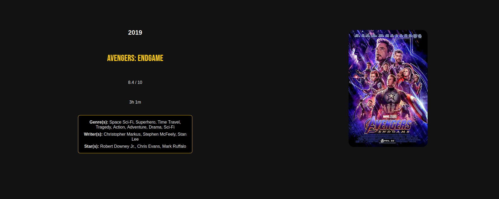

**Live Demo**
[Explore the visualizations on GitHub Pages](https://com-480-data-visualization.github.io/404NotFound/index.html)

---

## Overview

What makes a film “successful”? Is it the budget, the genre, the language, or a combination of factors? This project explores over six decades of movie data (1960–2025) to uncover patterns behind commercial, critical, and award‐based success. By integrating box‐office figures, IMDb ratings, and Oscar counts, we reveal how these dimensions interact—and how they’ve shifted over time.

## Data Sources

* **IMDb Movies (1960–2025)**
  – Kaggle dataset of \~30,000 top films per year (budgets, grosses, ratings, runtime, etc.)
  – CSV download: [https://www.kaggle.com/datasets/raedaddala/imdb-movies-from-1960-to-2023/data](https://www.kaggle.com/datasets/raedaddala/imdb-movies-from-1960-to-2023/data)
* **OMDb API**
  – Automatically retrieved movie posters to enrich the visuals

## Technical Setup

Built with standard web technologies and D3.js for dynamic, interactive charts. No backend required.

* **Clone the repo**

  ```bash
  git clone git@github.com:com-480-data-visualization/404NotFound.git
  ```

git clone [https://github.com/com-480-data-visualization/404NotFound.git](https://github.com/com-480-data-visualization/404NotFound.git)
cd 404NotFound


- **Dependencies**  
  – None beyond a modern web browser  
  – All libraries (D3.js, Tom Select.js) are included in `/js`
- **Optional**  
  – Visit directly on GitHub Pages:  
    `https://com-480-data-visualization.github.io/404NotFound/explore.html`

## Usage
1. **Open** `index.html` in Chrome, Firefox, Safari, WebStorm, etc.
2. **Interact** via the timeline filter, dropdowns, and clickable chart elements.
3. **Drill down** into bubbles or link flows to view detailed movie information.

## Project Structure


404NotFound/
├─ index.html          ← Homepage & project intro  
├─ explore.html        ← Sankey diagram of success metrics  
├─ analysis.html       ← Bubble chart (budget, genre, language vs. success)  
├─ detail.html         ← Movie‐level detail view  
├─ assets/             ← Shared UI components  
│  ├─ components/      ← navbar.html, footer.html, timeline.html  
│  ├─ css/             ← Stylesheets (IMDb‐inspired yellow & dark theme)  
│  ├─ data/            ← Cleaned CSV dataset  
│  ├─ img/             ← Pre‐downloaded movie posters  
│  └─ js/              ← D3.js scripts & interactivity logic  
└─ README.md           ← (you are here)  


## Visualizations
- **Sankey Diagram** (`explore.html`)  
  – Multi‐dimension flows between rating tiers, gross categories, and award counts  
  – Hover & click to isolate and filter the rest of the interface
  
- **Bubble Chart** (`analysis.html`)  
  – Three selectable “layers” (e.g. budget bin, genre, language)  
  – Success metric of choice (box‐office, rating, awards)  
  – Zoomable bubbles showing top‐100 films; click for poster & details

- **Detail View** (`detail.html`)  
  – Poster, synopsis, and all metadata for selected film


## Continuous Deployment
- Automatically published via GitHub Actions → GitHub Pages
- Any commit to `main` updates the live site at  
  `https://com-480-data-visualization.github.io/404NotFound/`

## License & Contributing
This project is now closed for contributions and does not include an open‐source license.  
Thank you for exploring!

